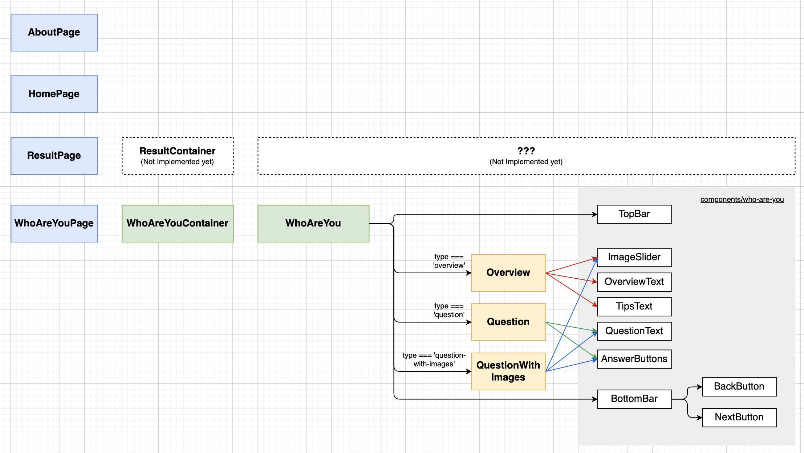

200814_TIL
===

오늘은 코드 구조 리팩터링을 진행했다. 조금 더 효율적으로 컴포넌트들을 활용하고, 그러면서도 최대한 불필요한 props를 넘겨야 하는 구조를 끊어내기 위해 노력했다. 어려운 부분도 있었지만, 깔끔한 구조를 만들어나가는 일은 확실히 재미 있는 거 같다.

[내일의 할 일]
1. 디자인 디테일한 부분 수정하기 (특히, 클릭했을 때 하트 나오도록!)
2. 결과창 디자인 시작하기
3. 사진고르기
4. 회고하기

