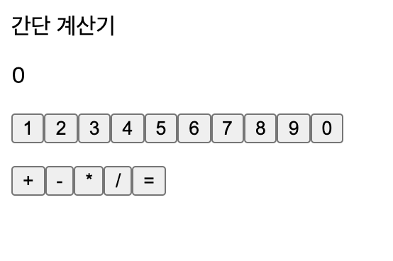

200607_TIL
===

오늘은, 처음 과제를 시작했던 월요일에는 이해되지 않았던 내용들을 다시 돌아보며 정리해보기로 한다.

DOM 이란 무엇인가?
---
Mozilla 재단에서 정리 해놓은 javascript docs에서는 DOM에 대해서 이렇게 설명한다.
> 문서 객체 모델(The Document Object Model, 이하 DOM) 은 HTML, XML 문서의 프로그래밍 interface 이다. 

[참고]
https://developer.mozilla.org/ko/docs/Web/API/Document_Object_Model/소개

처음에 과제를 시작했을 때는, **DOM**이 어떤 것인지 감이 잡히지를 않았다. (도대체 이게 무슨소리냐!) **DOM**에 대해 이해를 하지는 못했지만, 내가 과제를 하기 전 아샬님의 강의를 보며 알 수 있었던 것은 다음과 같다.

1. javascript로 HTML 문서를 만들어 냈다.
2. node, element 등으로 나눠서 HTML 문서를 만들어 낸다. (??)

```javascript
document.getElementById('app').appendChild(
  createElement(
    'div', 
    createElement(
      'p', 
      ...[1,2,3].map(i => (document.createTextNode(i))),
      document.createTextNode('hello world...'),
      document.createTextNode('hello world...2'),
    ),
    createElement(
      'p', 
      document.createTextNode('hi'),
      document.createTextNode('hi2'),
    ),
));
```

과제를 전부 제출하고 나서, 다시 한 번 과제를 살펴보며 **DOM**이 무엇인지 다시 생각해보게 되었다. **DOM**이란 무엇일까? 아니, 무엇인지 이해하기 전에 왜 필요할까?

~~(여기서부터는 내가 상상력을 발휘하여 정리한 것이니, 정답이라고 생각하지 마시길!)~~


내가 지금 연습하고 있는 '간단한 계산기' (라고 하지만 나에게는 어려운 계산기..)는 고작 코드 길이가 130줄 정도밖에 되지 않는다. 화면에도 '제목', '결과', '버튼 15개' 만 나오는 아주 간단한 코드인 것이다.



하지만, 우리가 마주하는 대부분의 웹서비스는 이 것보다 훨씬 복잡할 것이다. 수많은 정보들이 HTML 문서를 통해 사용자에게 보여지고, 사용자는 서버가 전달해주는 HTML 문서를 보고 조작함으로서 웹 서비스를 이용하게 될 것이다.

개발자들은 이 복잡한 웹서비스를 구현하기 위해서 **HTML**만으로 웹을 구현하는 것은 부족하다고 느꼈을 것이다. **javascript**가 탄생하게 된 배경도 여기에 있다고 들었다. 처음에 웹은 단순한 정보만을 보여줬지만, 버튼을 누르면 결과가 나오는 것과 같이 사용자의 행동에 반응하는 웹을 만들기 위해서는 새로운 언어가 필요했던 것이다. 

**javascript**가 나옴으로서 비로소 동적인 웹서비스를 만들 수 있게 되었지만, **javascript**는 이 것으로 자신의 역할을 다 한걸까? **HTML**은 정보는 나타낼 수 있지만, 논리를 만들어 낼 수는 없다. **javascript**는 복잡한 논리들을 만들 수 있다. 몇 줄의 코드로도 비슷하게 반복되는 것을 만들 수도 있다. 

1-2 과제에서는 숫자 버튼을 열개를 만들어야 했다. 만약, 내가 **HTML** 코드로 하나하나 만든다면, 버튼의 UI만 구현하는데도 장황한 코드가 반복되었을 것이다. 하지만, **javascript**의 ```map```을 이용해서 구현하면 아래와 같이 10줄의 코드로 불필요한 중복 없이 버튼들을 구현할 수 있다.


```javascript
const numbers = [1, 2, 3, 4, 5, 6, 7, 8, 9, 0];

operators.map(
  (i) => (
    <button type="button" onClick={() => handleClick.operator(i, repository)}>
      {i}
    </button>
  ),
)
```

위와 같이, **javascript**로 **HTML**을 조작하면 더 쉽게 **HTML**문서를 작성할 수 있을 거라는 생각을 하게 된게 아닐까? 그렇게 된다면, **HTML** 코드들을 복잡하고 길게 나열하지 않고도, 복잡한 웹을 깔끔하고 효율적으로 코드를 통해 구현할 수 있게 된다.

그렇다면, **javascript**가 **HTML**을 조작하려면 어떻게 해야할까? **HTML**에 있는 각 요소들을 특정 **javascript**에서 조작할 수 있는 단위로 나누고, 그 단위들을 지칭하는 이름과, 단위들을 조작하는 방식들이 정의되어야 할 것이다. 예를 들면, ```<p></p>```가 하나의 묶음인데, 이를 표현하는 하나의 용어(?) 혹은 정의가 필요할 것이다. 

```HTML
<p>
  <h1>hello!</h1>
</p>
```


> 이 문서의 대부분의 예제와 같이, 위에서 사용된 예제는 JavaScript이다. 위의 예제는 자바스크립트로 작성되었지만 문서(document) 와 문서의 요소(element) 에 접근하기 위해 DOM 이 사용되었다. DOM 은 프로그래밍 언어는 아니지만 DOM 이 없다면 자바스크립트 언어는 웹 페이지 또는 XML 페이지 및 요소들과 관련된 모델이나 개념들에 대한 정보를 갖지 못하게 된다. 

즉, Mozilla 재단에서 말한 'interface'라는 것이 이런게 아닐까! **HTML**을 개념적으로 나눴을 때, 우리가 다른 프로그래밍 언어를 통해 조작을 할 수 있게 된다. 그래서 우리는 **DOM** 이 필요하고, 우리가 이를 interface라고 부르는 이유일 것이다.

(DOM에는 element, node, document라는 개념이 있다는데, 이건 조금 더 이해하고 정리해봐야 겠다! 자세한 내용은 코드숨에서 제공해준 링크를 참고하자)

https://poiemaweb.com/js-dom


JSX란 무엇인가?
---
위에서 말했듯이, 우리는 javascript를 통해 HTML 문서를 더 쉽고 효율적으로 작성하고 싶은 욕구를 갖게 되었다. 그런데, 문제는 JavaScript만으로는 우리의 욕구를 해결하기 힘들다. 우리의 목표를 달성하기 위해서는, HTML과 javascript가 적절히 섞인 새로운 무언가가 필요한 것이다.

```JSX
const element = <h1>Hello, world!</h1>;
```
javascript와 HTML이 같이 있는 듯한 위 문법은 놀랍게도(?), 문자열도 아니고 HTML도 아니라고 한다. 위 문법을 우리는 JSX라고 부르고, 이는 JavaScript를 확장한 문법이다. offical document에서는 JSX를 이렇게 소개한다.

> JSX라 하며 JavaScript를 확장한 문법입니다. UI가 어떻게 생겨야 하는지 설명하기 위해 React와 함께 사용할 것을 권장합니다. JSX라고 하면 템플릿 언어가 떠오를 수도 있지만, JavaScript의 모든 기능이 포함되어 있습니다.

내가 이제까지 과제를 하며 써왔던 코드들도 모두 JSX였던 것이다. 
(javascript와 HTML 섞어서 쓰는 건줄 알았는데, 그게 아니라고!)

[react official document]
https://ko.reactjs.org/docs/introducing-jsx.html


Babel 이란 무엇인가?
---
> **Babel is a JavaScript compiler**
Babel is a toolchain that is mainly used to convert ECMAScript 2015+ code into a backwards compatible version of JavaScript in current and older browsers or environments. Here are the main things Babel can do for you:

바벨의 공식 문서에서는, 자신을 'JavaScript 컴파일러'라고 소개하고 있다. 최신 JavaScript를 사용하거나, 특히 react에서 JSX를 사용할 때 이를 적절하게 변환해주는 도구가 필요하다. 바벨은 이 역할을 해주고, 그렇기 때문에 우리가 프로젝트를 새로 만들 때 babel을 설치해야 하는 것이다.

[babel official document]
https://babeljs.io/docs/en/

