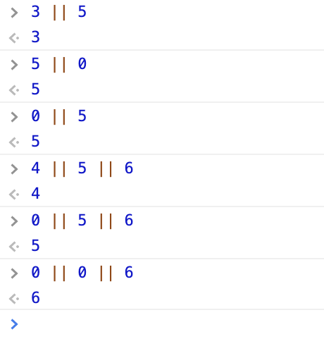

200608_TIL
===

1주차 과제 피드백 강의
---
아샬님의 피드백 강의를 듣고, 나의 코드와의 차이점에 대해서 정리해보기로 한다.

### **<과제1>**

1. **object의 사용** : 아샬님은 count 뿐만 아니라 다른 상태들도 전달해야할 수 있으니, Object로 전달하면 더 좋다.
2. **```render()``` 내에서 연산** : 따로 변수를 정의한 후 그 값을 넘겨주지 않고, 괄호 안에서 해결했다.

    ```javascript
    function render({ count }) {
      function handleClick() {
        render({ count: count + 1 } );
      }
    }
    ```


### **<과제2>**

1. **문제 해결 방식**: 사용자가 입력한 값들을 저장하는 방식이 달랐다.

    ```javascript
    //아샬님 - object 안에서 각각을 구분하여 저장
    const initialState = {
      accumulator: 0,
      number: 0,
      operator: '',
    }
    ```
    ```javascript
    // 나 - 숫자, 연산자 구분 없이 차례대로 넣었다.
    const initialRepository = [0];
    ```

2. **```if``` 대신 ```||```**

    오늘의 강의 중에는 이게 제일 충격쓰... 아샬님은 if문을 하나도 쓰지 않고 코드를 작성하셨다. ||를 쓰는 것은 javascript에서 많이 쓰는 패턴이라고 하니 익혀야겠다.

    ```javascript
    const defaultFunction = (x, y) => x || y;

    function calculate(operator, accumulator, number) {
      return operatorFunctions[operator] || defaultFunction(accumulator, number);
    }
    ```
    ```javascript
    //사용자가 누른 버튼숫자를 보여준다 -> 없으면 accumulator를 보여준다.
    <p>{number || accumulator}</p>
    ```

    
    조금 더 찾아보니,
    * ```||``` 는 어떤 처음 오는 것이 우선순위를 가진다.
    * 0이 아닌 값을 반환한다.


      

**<궁금한 점>**
1. 괄호 혹은 ```return``` 안에서 연산을 하는 것이 좋은 코드인가? (ex: ```render(count+1)```)
2. 함수는 ```const``` 혹은 ```function``` 두가지 방법으로 정의할 수 있다. 언제 어떤 표현을 쓰는 것이 좋을까?

**<멘토님께 질문하고 얻은 답>**

1. 의도를 충분히 드러낼 때는 괜찮다. 그리고, ```||``` 를 사용해서 JavaScript 에서 복잡한 식을 간결하게 만들 수 있기 때문에, 위와 같은 방식으로 코드를 작성해도 괜찮다. (JavaScript 특유의 방식을 익힐 것)

    참고 : [MDN - JavaScript : Expressions and operators](https://developer.mozilla.org/en-US/docs/Web/JavaScript/Reference/Operators, "mdn link")

2. ```Class``` 내에서 메소드로는 arrow function 이 적합하지 않다. ```Class``` 내에서의 메소드로 사용할 때, ```this```를 사용하면 아무것도 가르키지 않기 때문이다.

    참고 : [MDN - JavaScript : this](https://developer.mozilla.org/en-US/docs/Web/JavaScript/Reference/Operators/this, "mdn link")

    


~~위 내용과 관련해서는 자기 전에 MDN 도큐먼트 읽고자야겠다...~~


React란 무엇인가
---

1. ```React```란 UI를 독립적이고 재사용 가능하게 만들수 있도록 하는 JavaScript 라이브러리이다.
2. 우리는 이전 과제에서 직접 DOM을 조작해서 화면을 그렸으나, ```React```가 이제부터는 알아서 그려줄 것이다.
3. HTML의 태그를 쓰듯이 함수를 가져와서 쓸 수 있다.
4. Custom Tag 안에 들어 가는 값 (ex: ```<Button>{i}</Button>```) 는 props라는 객체로 들어온다. 보통은 함수의 () 안에서 바로 destructuring을 해준다. 
    ```javascript
    fuction Counter (props) {
      const { children } = props;

    }
    function Counter({ count }){

    }
    ``` 
5. handleClick의 결과를 화면에 다시 그려주고 싶을 때 이전 과제에서는, ```render```를 사용했다. 그렇지만, ```React```에서는 ```hook```을 써서 해결한다.
6. ```useState```으로 상태를 만들고, ```setState```으로 화면을 다시 그려준다.
    ```javascript
    function Counter() {
      const [state, setState] = useState({
        count: 0 
      });

      function handleClick() {
        setState({
          count: count + 1,
        });
      }
    }
    ```
7. ```React```의 목적은 관심사의 분리다. (상태를 조작하는 애들과 상태를 그려주는 애들 분리!!)


* **헷갈리는 거 정리**

  JSX 안에서 JavaScript는 {}로 wrapping 해서 표현을 한다.


