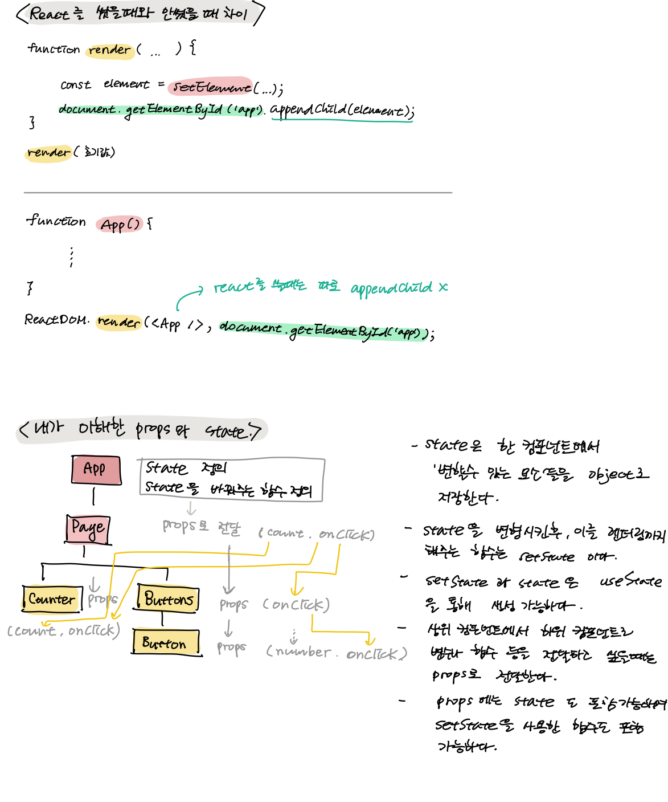

200610_TIL
===

props와 state이란?
---
~~귀찮아서 아이패드에 정리한 거 그대로 캡처해서 붙임~~

선언형 프로그래밍이란?
---
'선언형 프로그래밍'이란, 프로그래밍 패러다임 중에 하나이다. 보통 '선언형 프로그래밍'을 '명령형 프로그래밍'과 많이 비교하는데, 선언형 프로그래밍은 'what'에 대해서 코드를 작성하는 방식을 말한다. 명령형 프로그래밍은 'how'에 대해서 코드를 작성하는 방식을 말한다. (조금 더 공부해보기로 하자!)

파일 이름 대소문자
---
파일이름을 소문자에서 대문자로 바꿔서 커밋했는데, 문제가 생겼다..
해결하는 과정에서 깨달은 것들을 정리해보면,

* mac과 window에서는 파일/폴더 이름에서 대소문자를 구분하지 못한다.
* 그러나, linux에서는 파일/폴더 이름에서 대소문자를 구분한다. (+과제의 PR 제출할 때 돌아가는 CI에서도..!)
* 이런 문제가 발생했을 때, 이전에 있었던 파일들을 삭제할 후, 다시 파일을 넣어서 push 한다.

