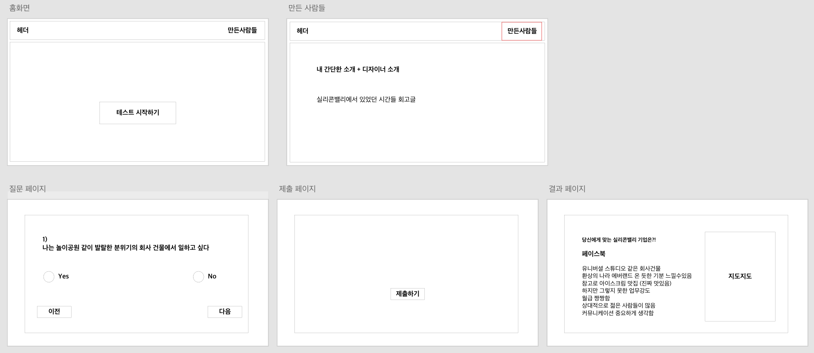

200727_TIL
===

### [기본 질문]

1. **이 앱을 언제 사용하나요?**

    자신에게 맞는 실리콘밸리 기업이 어떤 기업인지 (정말 재미로) 추천받고 정보를 알게 되는 용도로 사용합니다. 

2. **제약 조건은 무엇인가요?**
    
    사용자의 답변에 맞춰서 적절한 실리콘밸리 기업을 추천해줍니다.
    해당 실리콘밸리의 재밌는 문화들을 소개해줍니다.
    구글 지도에서 해당 기업의 위치를 보여줍니다.

3. **구체적인 사례는 무엇인가요?**
    
    사용자는 웹 페이지에 들어와서, 여러 질문에 대한 답을 '예 아니오'의 형태로 자신의 성향에 맞게 답을 합니다. (선택지 형태는 바뀔 수 있음) 그런 다음, 자신에게 맞는 실리콘밸리 기업을 추천받고 해당 기업의 재밌는 정보들을 확인합니다.

4. **이번주에 구현 할 기능을 우선 순위대로 작성해 주세요.**

    이번주는 디자인 빼고 처음부터 끝까지 전체적인 기능을 대충 구현해보려고 합니다. (API 써야하는 부분빼고)

    - [ ] 프로젝트 세팅하기
    - [ ] 홈화면 구현하기 - 헤더, 버튼
    - [ ] 질문 화면 구현하기 - 예시 질문을 json파일로 저장해놓고, 불러와서 화면을 구성하도록 함.
    - [ ] 사용자의 답을 바탕으로 결과값을 계산하는 로직 구현하기 
    - [ ] 결과 화면 구현하기 
    - [ ] 만든 사람들 소개 및 회고글 구현하기 - Markdown 패키지 알아보기 (마지막 순위)

### [나를 위한 질문]

아래 내용은 제가 생각을 정리하기 위해서 정리한 내용입니다. 

1. **왜 이 기획을 하게 되었나?**
    
    재밌고 신선하면서 나의 이야기를 담을 기획이 무엇이 있을까 고민해봤다. 그렇게 하다가 자연스럽게 나온 주제가 '실리콘밸리'이었다. 
    
    3개월동안 열심히 돌아다닌 덕분에, 거기 있었던 엔지니어와 창업가 등등 다양한 사람들도 만나보고, 우리 제품 프로토타입을 가지고 거기 있는 기업이랑 프로토타입 테스트도 해보고, 거기 있는 기업가서 점심 얻어먹기 도장깨기(??)도 하고 다니는 조금은 특별한 경험들을 했다. 거기서 주워듣고 경험한 것들을 바탕으로 한 번 만들어보면 재밌을 거 같다

    +) 가서 보고 느낀 것을 글로 정리해본 적이 없었다. 이번에 한 번 정리해서 넣어 보면 좋을 거 같다.

2. **전체적인 계획은?**

    * 1주차: 임시 데이터를 바탕으로 대충 전체적으로 구현해보기 (지도 API 쓰는건 제외)
    * 2주차: 질문/점수로직 정리해서 반영하고, 구체적인 기업 내용 넣기 
    * 3주차: 디자인 반영하기
    * 4주차: 디자인 반영하기 + 코드 정리하기

3. **구현 외에 이번주에 해야하는 것은?**

    * 전체적인 레이아웃 / 기획 잡기 (월~수)
    * 예시 질문, 점수 매기는 로직 임시로 만들기 (월~수)
    * 디자인 컨셉 잡기 (주말)
    * 실리콘밸리 기업, 각 기업별 특징 정리하기 (만났던 사람들에게 연락해서 물어보기)

4. **가장 큰 난관이 무엇일까**
    
    질문 구성하고 점수를 매기는 로직을 만드는 것이 쉽지 않아보인다. 더 정보들을 주워 모아야하는 것이 제일 큰 난관인 거 같다. (얘 때문에 기획이 엎어질수도 있을 거 같음)

5. **대충 생각한 화면 레이아웃은?**
    
    

